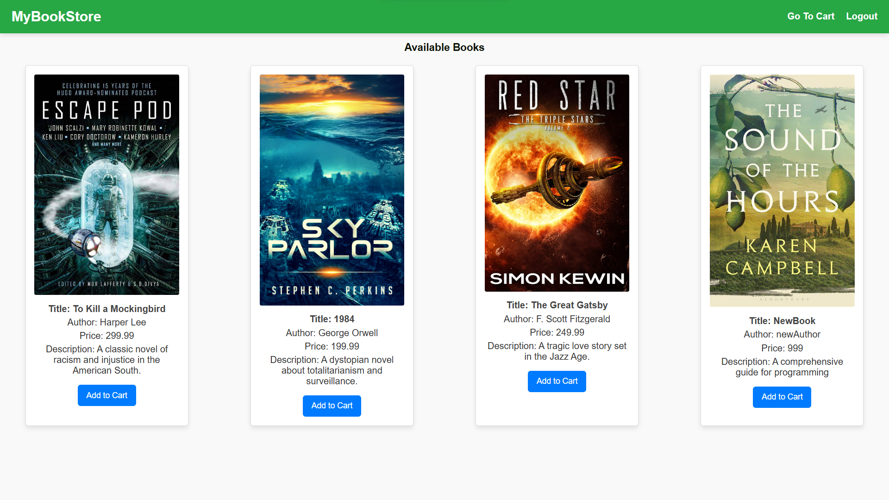
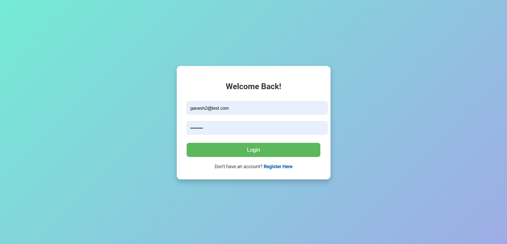
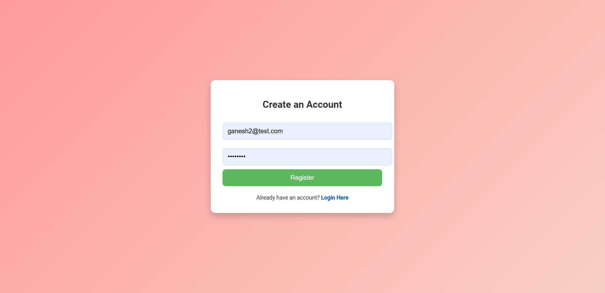
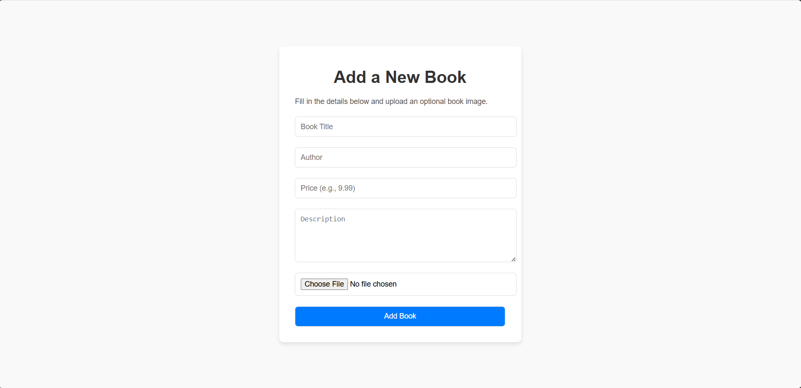
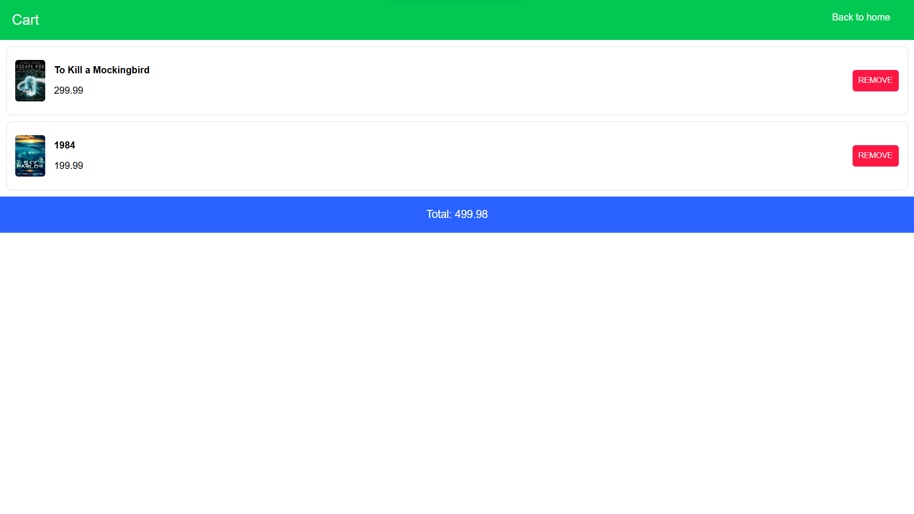

# Book Store Application

## Overview
This is a Flask and CGI (perl) based web application for a book store. It includes features for user registration, login, adding books, managing a cart, and retrieving books. The application uses SQLAlchemy for database operations and Flask-CORS for handling cross-origin requests.

## Features
- User Registration and Login
- Add Books to the Store
- Manage Cart (Add/Remove Books)
- Retrieve Books and Cart Items

## Project Structure
- `app.py`: Main application file.
- `cgi-bin/`: Contains CGI scripts for various pages.
- `images/`: Contains screenshots and images used in the application.
- `instance/`: Contains the SQLite database file.
- `styles/`: Contains CSS files for styling.

## Setup
1. **Clone the Repository:**
   ```sh
   git clone https://github.com/ganesh57803/book-store.git
   cd book-store
   ```

2. **Install Dependencies:**
   ```sh
   pip install -r requirements.txt
   ```

3. **Run the Application:**
   ```sh
   python app.py
   ```

4. **Access the Application:**
   Open your browser and navigate to `http://127.0.0.1:5000`.

## Screenshots

### Home Page


### Login Page


### Register Page


### Add Books Page


### Cart Page


## Contributing
Contributions are welcome! Please open an issue or submit a pull request if you have any improvements or bug fixes.

Enjoy using the Book Store Application!
